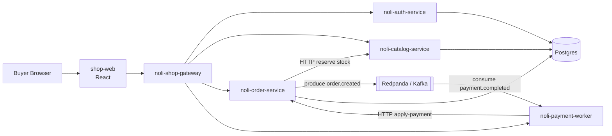

# NOLI Shop — Microservice Architecture

Mục tiêu: **nhiều service node** trên Instana / Coroot (OTLP), không còn monolith.

## Service map



| Service | Port | OTEL `service.name` | Vai trò |
|---------|------|---------------------|---------|
| gateway | 8080 | `noli-shop-gateway` | Entry `/api/*`, fan-out |
| auth-service | 8001 | `noli-auth-service` | Đăng ký / login / me |
| catalog-service | 8002 | `noli-catalog-service` | Sản phẩm, categories, reserve stock |
| order-service | 8003 | `noli-order-service` | Đơn hàng, admin, Kafka produce |
| payment-worker | 8004 | `noli-payment-worker` | Confirm CK + Kafka consumer |
| shop-web | 5173 | (browser) | UI |

## Instana / Coroot edges kỳ vọng

1. `noli-shop-gateway` → `noli-auth-service` (login)
2. `noli-shop-gateway` → `noli-catalog-service` (browse)
3. `noli-shop-gateway` → `noli-order-service` (checkout)
4. `noli-order-service` → `noli-catalog-service` (reserve)
5. `noli-shop-gateway` → `noli-payment-worker` (confirm)
6. `noli-payment-worker` → `noli-order-service` (apply-payment)
7. Kafka messaging spans (`messaging.system=kafka`) khi có bootstrap

## Chạy

```bash
# Full stack (Postgres + Redpanda + services + web)
docker compose up --build

# UI: http://localhost:5173
# Gateway health: http://localhost:8080/api/health
```

OTLP (khi có collector):

```bash
export OTEL_EXPORTER_OTLP_ENDPOINT=http://opentelemetry-collector.observability.svc:4317
docker compose up --build
```

## Local dev (không Docker services)

```powershell
.\scripts\run-services.ps1
```

Cần Postgres (hoặc `DATABASE_URL=sqlite:///./noli.db` dùng chung — chỉ lab).

## Admin

`admin@noli.shop` / `admin123`

## Instana presence

Services chỉ hiện trên Instana khi còn telemetry. NOLI gửi heartbeat span mỗi 30s — xem [docs/instana-presence.md](docs/instana-presence.md).
